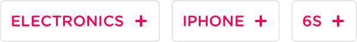
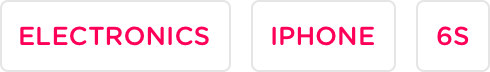
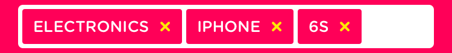

# SnapTagsView

***Currently work in progress, not yet fit for consumption***

SnapTagsView is our collection of:
- Tag Buttons with an on/off button
- Search bar that displays text as tags when it is not first responder
- Tag bar view that acts as a stand-alone search field using tags

Download Snapsale from the [App Store](http://r.yoz.io/x5.c.h?utm_content=GithubSnapTagsView&instanceId=5984489495330816&yozio_ipad_deeplink_url=snapsale://instance/5984489495330816&yozio_iphone_deeplink_url=snapsale://instance/5984489495330816) to see it in action.

# Design
This module implements the following five tag designs, the tags can be used in a centered and/or a left-aligned layout.

#### Tag state toggled

This style is used together with the untoggled state tags.

---

#### Tags state untoggled

This style is used together with the toggled state tags.

---

#### Tags state clickable

This style is used in the tagbar.

---

#### Tags state toggled alternate version for contrast background colors.

This style is used in the centered collection.

---

###Searchbar with tags

#Actual implementation
...snapshots go here