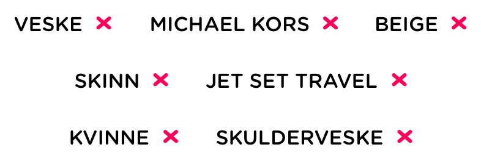
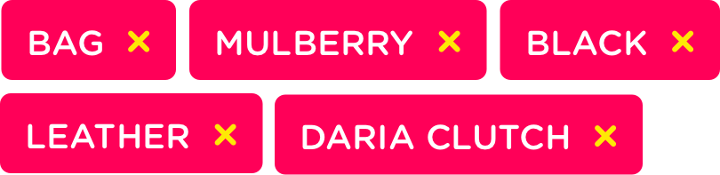
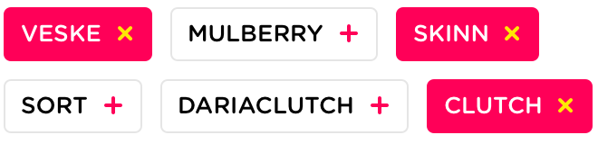
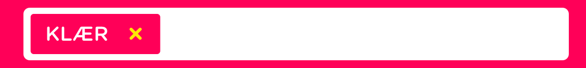

# SnapTagsView

***Currently work in progress, not yet fit for consumption***

SnapTagsView is our collection of:
- Tag Buttons with an on/off button
- Search bar that displays text as tags when it is not first responder
- Tag bar view that acts as a stand-alone search field using tags

Please download Snapsale to see it in action

#Design
This module implements the following five tag designs:

###Centered collection

###Left-aligned collection

####Left-aligned with some buttons turned on and off

###Searchbar with tags

###Tagbar

#Actual implementation
...snapshots go here